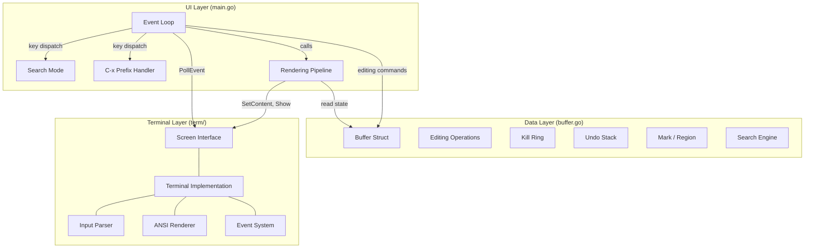
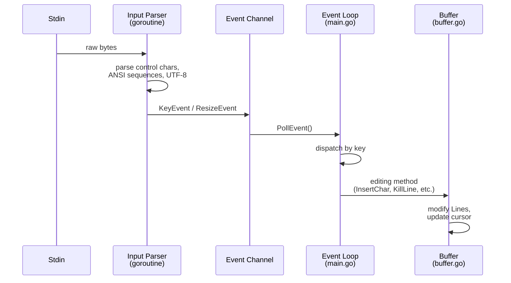
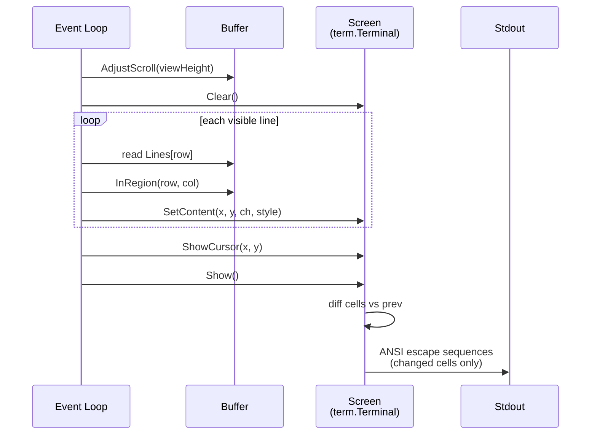

# Architecture Overview

goomacs is a lightweight, Emacs-like terminal text editor written in pure Go with zero external dependencies. The architecture follows a clean three-layer design separating data management, terminal I/O, and UI logic.

## Layer Diagram



## Module Structure

```
goomacs/                     (module: goomacs)
├── main.go                 UI layer: event loop, rendering, keybinding dispatch
├── buffer.go               Data layer: Buffer struct, text operations
├── buffer_test.go          Buffer unit tests (69 tests)
├── main_test.go            Main package tests
├── go.mod                  Module definition (zero dependencies)
└── term/                   Terminal layer (internal package)
    ├── screen.go           Screen interface, Event types, Style, KeyCode constants
    ├── terminal.go         Terminal struct, raw mode, ANSI rendering, input parsing
    └── terminal_test.go    Terminal backend tests (16 tests)
```

## Data Flow

### Input Processing



### Rendering Pipeline



## File Responsibilities

| File | Lines | Responsibility |
|------|-------|----------------|
| `main.go` | ~501 | Event loop, keybinding dispatch, search mode state machine, C-x prefix handling, rendering functions (`drawBuffer`, `drawStatusLine`, `drawMessageLine`), tab expansion |
| `buffer.go` | ~601 | `Buffer` struct, cursor movement, character insertion/deletion, kill ring, yank, mark/region, incremental search, undo/redo, file I/O |
| `term/screen.go` | ~136 | `Screen` interface definition, `Event`/`KeyEvent`/`ResizeEvent` types, `Style` type, `KeyCode` and `ModMask` constants |
| `term/terminal.go` | ~516 | `Terminal` struct implementing `Screen`, raw mode via termios syscalls, ANSI escape sequence rendering with cell diffing, keyboard input parsing, SIGWINCH resize handling |

## Design Principles

- **Separation of concerns** -- Buffer knows nothing about the terminal; the terminal knows nothing about text editing; main.go bridges the two.
- **Minimal abstraction** -- No framework, no plugin system, no unnecessary interfaces. Three files plus one package.
- **Zero dependencies** -- Terminal I/O uses raw syscalls and ANSI escape sequences. Only the Go standard library is used.
- **Snapshot-based undo** -- Full buffer state is saved before each edit. Simple but bounded (max 100 entries).
- **Diff-based rendering** -- Only changed screen cells are written to stdout, minimizing I/O.
