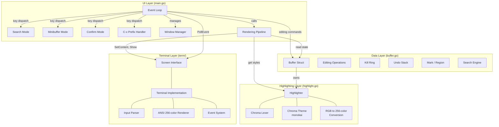
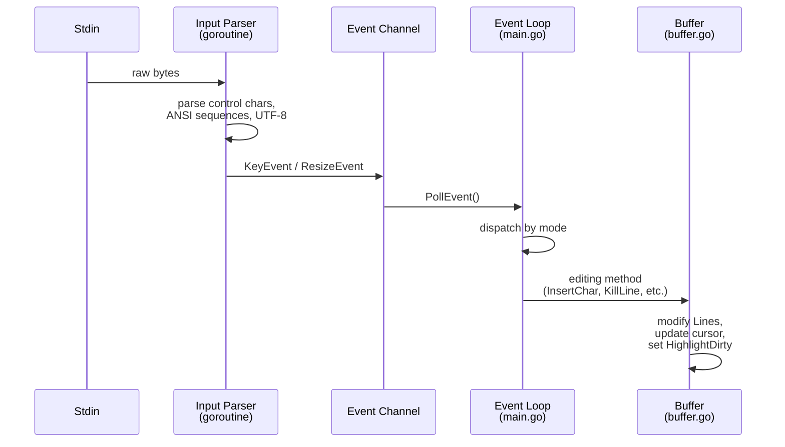
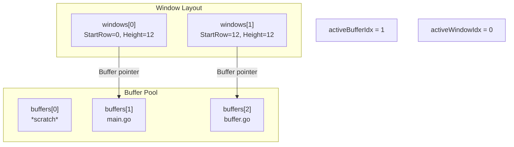

# Architecture Overview

goomacs is a lightweight, Emacs-like terminal text editor written in pure Go. It uses the [Chroma](https://github.com/alecthomas/chroma) library for syntax highlighting and a custom ANSI/VT100 terminal backend with no other external dependencies. The architecture follows a clean four-layer design.

## Layer Diagram



## Module Structure

```
goomacs/                      (module: goomacs)
├── main.go                  UI layer: event loop, window management, rendering, keybinding dispatch
├── buffer.go                Data layer: Buffer struct, text operations, file I/O
├── highlight.go             Highlighting layer: Chroma-based syntax coloring
├── buffer_test.go           Buffer unit tests (69 tests)
├── main_test.go             Main package tests
├── go.mod                   Module definition (Go 1.24, chroma/v2 dependency)
├── go.sum                   Dependency checksums
└── term/                    Terminal layer (internal package)
    ├── screen.go            Screen interface, Event types, Style, Color, KeyCode constants
    ├── terminal.go          Terminal struct, raw mode, 256-color ANSI rendering, input parsing
    └── terminal_test.go     Terminal backend tests (26 tests)
```

## Data Flow

### Input Processing



### Rendering Pipeline

```mermaid
sequenceDiagram
    participant Loop as Event Loop
    participant Win as Window
    participant Buf as Buffer
    participant HL as Highlighter
    participant Screen as Screen<br/>(term.Terminal)
    participant Stdout

    Loop->>Win: AdjustScroll() (active window only)
    Loop->>Screen: Clear()

    loop each window
        Loop->>Buf: check HighlightDirty
        alt HighlightDirty and Highlighter != nil
            Loop->>HL: Highlight(buf.Lines)
            Loop->>Buf: HighlightDirty = false
        end
        loop each visible cell
            Loop->>HL: StyleAt(row, col)
            HL-->>Loop: base style (colors + bold)
            Loop->>Buf: InRegion(row, col)?
            Note over Loop: overlay reverse video<br/>for region/search
            Loop->>Screen: SetContent(x, y, ch, style)
        end
        Loop->>Screen: drawWindowStatusLine()
    end

    Loop->>Screen: ShowCursor(x, y)
    Loop->>Screen: Show()
    Screen->>Screen: diff cells vs prev
    Screen->>Stdout: ANSI 256-color<br/>escape sequences
```

## Multi-Buffer and Window Architecture



- **Buffers** are stored in a flat slice (`buffers []*Buffer`). Each buffer holds its own content, cursor, kill ring, undo stack, and optional `Highlighter`.
- **Windows** are viewports into buffers. Each `Window` has its own `ScrollOffset`, `StartRow`, and `Height`. Multiple windows can reference the same buffer.
- `recalcWindows()` evenly distributes available screen rows among all windows, reserving 1 row for the message line.
- `AdjustScroll()` is only called for the **active** window to prevent scroll bleeding when multiple windows share a buffer.

## File Responsibilities

| File | Responsibility |
|------|----------------|
| `main.go` | Event loop, multi-mode key dispatch (search, minibuffer, confirm, C-x prefix, normal), window management (split, close, switch), rendering pipeline (`drawWindowContent`, `drawWindowStatusLine`, `drawMessageLine`), tab expansion |
| `buffer.go` | `Buffer` struct, cursor movement, editing (insert, delete, kill, yank), mark/region, incremental search, undo/redo, file I/O, highlight dirty flag |
| `highlight.go` | `Highlighter` struct, Chroma lexer/theme integration, tokenization, RGB-to-256-color conversion, per-cell style caching |
| `term/screen.go` | `Screen` interface, `Event`/`KeyEvent`/`ResizeEvent` types, `Style` struct (fg/bg/reverse/bold), `Color` type, `KeyCode`/`ModMask` constants |
| `term/terminal.go` | `Terminal` struct implementing `Screen`, raw mode via termios syscalls, 256-color ANSI rendering with cell diffing, `writeStyledCell()` helper, keyboard input parsing, SIGWINCH resize handling |

## Design Principles

- **Separation of concerns** -- Buffer knows nothing about the terminal; the terminal knows nothing about text editing; main.go bridges them. The highlighter knows about Chroma but not about the terminal.
- **Minimal abstraction** -- No framework, no plugin system. Four source files plus one package.
- **Lazy re-highlighting** -- Syntax highlighting only re-runs when content changes (`HighlightDirty` flag), not on every redraw.
- **Snapshot-based undo** -- Full buffer state is saved before each edit. Simple but bounded (max 100 entries).
- **Diff-based rendering** -- Only changed screen cells are written to stdout, minimizing I/O.
- **Per-window scroll isolation** -- Each window maintains its own `ScrollOffset`; `AdjustScroll()` is only called for the active window.
