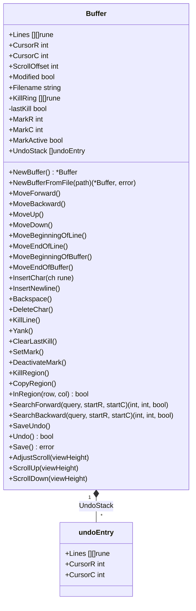
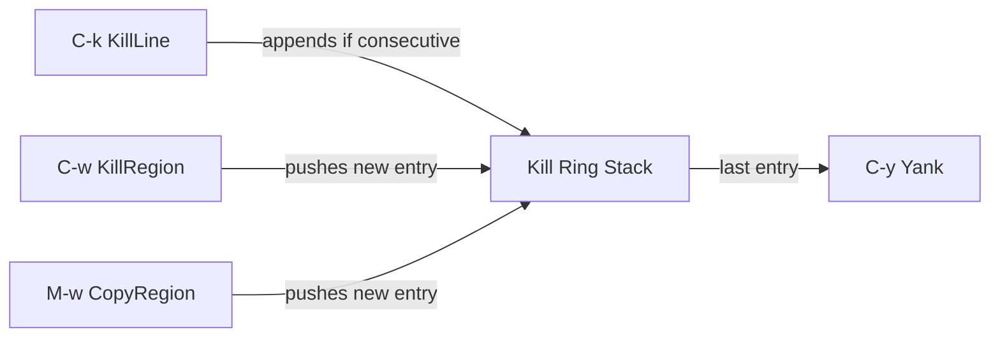
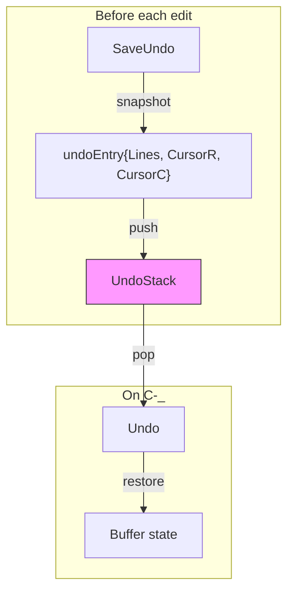

# Buffer Data Structure

The `Buffer` struct in `buffer.go` is the core data model of goomacs. It manages text content, cursor state, selection, kill ring, undo history, and file I/O.

## Struct Overview



## Line Storage Design

Text is stored as `[][]rune` -- a slice of lines, where each line is a slice of runes.

```
Lines[0] = ['H', 'e', 'l', 'l', 'o']
Lines[1] = ['W', 'o', 'r', 'l', 'd']
Lines[2] = []                           ← empty line
```

**Why `[]rune` instead of `string`?**
- Rune slices allow O(1) indexed access for cursor positioning
- Character insertion/deletion at arbitrary positions is straightforward with slice operations
- Proper Unicode support (each element is a full code point)

**Why not a rope or gap buffer?**
- Simplicity -- the editor targets single-file editing of typical source files
- Slice operations are fast enough for the intended use case
- Easier to reason about for undo snapshots

## Cursor and Viewport

```
┌─────────────────────────────────┐
│  (ScrollOffset = 5)             │  ← lines 0-4 not visible
├─────────────────────────────────┤
│  Line 5: func main() {         │  ← first visible line
│  Line 6:     buf := NewBuf()   │
│  Line 7:     buf.Insert('x')   │  ← CursorR=7, CursorC=12
│  ...                           │
│  Line 29: }                    │  ← last visible line
├─────────────────────────────────┤
│  [filename] [Modified]  L8/100 │  ← status line (reverse video)
│  Mark set                      │  ← message line
└─────────────────────────────────┘
```

- `CursorR` / `CursorC` -- absolute position within `Lines` (0-based)
- `ScrollOffset` -- index of the first visible line
- `AdjustScroll(viewHeight)` ensures the cursor row stays within the visible viewport

## Operations

### Movement

| Method | Behavior |
|--------|----------|
| `MoveForward()` | Right one char; wraps to next line at EOL |
| `MoveBackward()` | Left one char; wraps to previous line at BOL |
| `MoveUp()` | Up one line; clamps column to line length |
| `MoveDown()` | Down one line; clamps column to line length |
| `MoveBeginningOfLine()` | Sets `CursorC = 0` |
| `MoveEndOfLine()` | Sets `CursorC = len(Lines[CursorR])` |
| `MoveBeginningOfBuffer()` | Sets cursor to `(0, 0)` |
| `MoveEndOfBuffer()` | Sets cursor to end of last line |

### Scrolling

| Method | Behavior |
|--------|----------|
| `ScrollDown(viewHeight)` | Page down; adjusts cursor if it leaves viewport |
| `ScrollUp(viewHeight)` | Page up; adjusts cursor if it leaves viewport |
| `AdjustScroll(viewHeight)` | Ensures cursor row is within `[ScrollOffset, ScrollOffset+viewHeight)` |

### Editing

| Method | Behavior |
|--------|----------|
| `InsertChar(ch)` | Inserts rune at cursor, advances cursor, sets `Modified` |
| `InsertNewline()` | Splits current line at cursor, creates new line below |
| `Backspace()` | Deletes char before cursor; at BOL, joins with previous line |
| `DeleteChar()` | Deletes char at cursor; at EOL, joins with next line |

### Kill Ring and Yank



- `KillLine()` -- Kills from cursor to end of line. At EOL, joins with next line. Consecutive kills append to the same kill ring entry via the `lastKill` flag.
- `KillRegion()` -- Kills the text between mark and point (cursor). Pushes to kill ring.
- `CopyRegion()` -- Copies region text to kill ring without deleting.
- `Yank()` -- Inserts the last kill ring entry at the cursor position.
- `ClearLastKill()` -- Called by the event loop on non-kill keys to reset the consecutive-kill tracker.

### Mark and Region

The mark defines one end of a text selection; the cursor (point) defines the other.

- `SetMark()` -- Sets mark at current cursor position, activates region.
- `DeactivateMark()` -- Turns off the active region (mark position is preserved).
- `InRegion(row, col)` -- Returns true if the given position falls within the active region. Used by the renderer to apply reverse video highlighting.
- `regionBounds()` -- Internal helper that orders mark and point so start <= end.
- `RegionText()` -- Returns the text between mark and point as `[]rune`.
- `deleteRegion()` -- Internal method that removes the region text and repositions the cursor.

### Search

- `SearchForward(query, startR, startC)` -- Scans forward from the given position with wraparound. Returns `(row, col, found)`.
- `SearchBackward(query, startR, startC)` -- Scans backward with wraparound.
- Both use linear substring matching via helper functions `indexRunes()` and `lastIndexRunes()`.

### Undo



- **Snapshot-based** -- `SaveUndo()` deep-copies all `Lines` and the cursor position into an `undoEntry`.
- **Bounded** -- Maximum 100 entries (`maxUndoEntries`). Oldest entries are discarded.
- **Caller-driven** -- The event loop in `main.go` calls `SaveUndo()` before every editing operation.
- `Undo()` pops the last entry and restores the buffer state. Returns `false` if the stack is empty.

### File I/O

- `NewBufferFromFile(path)` -- Reads a file, splits by newlines, initializes buffer with content and filename.
- `Save()` -- Writes buffer content to `Filename`. Uses atomic write (temp file + rename) for safety. Adds trailing newline. Returns `errNoFilename` if no filename is set.

## Test Coverage

The buffer has 69 unit tests in `buffer_test.go` covering:

- Buffer creation and initialization
- Character insertion (middle, end)
- Newline insertion and line splitting
- Backspace (middle, BOL join, origin boundary)
- Delete (middle, EOL join)
- All 8 movement directions with boundary and column clamping
- Scroll and viewport adjustment (7 tests)
- Kill line with consecutive-kill appending (5 tests)
- Mark/region operations (10 tests)
- Yank with single and multi-line text (3 tests)
- Copy region (2 tests)
- Undo at multiple levels and max entry limit (8 tests)
- Forward and backward search with wraparound (6+ tests)
