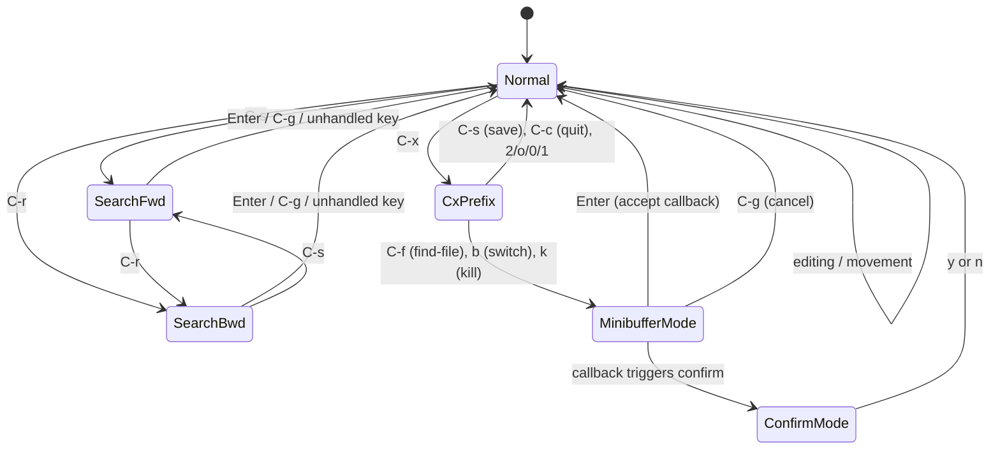
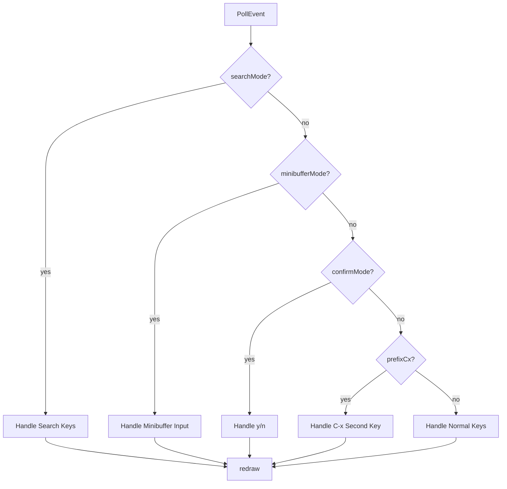
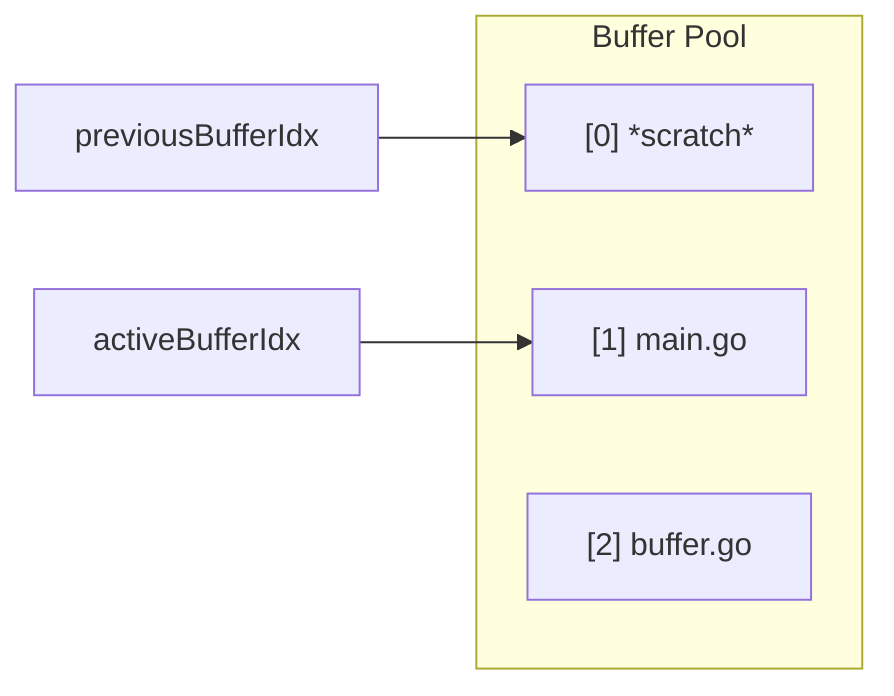
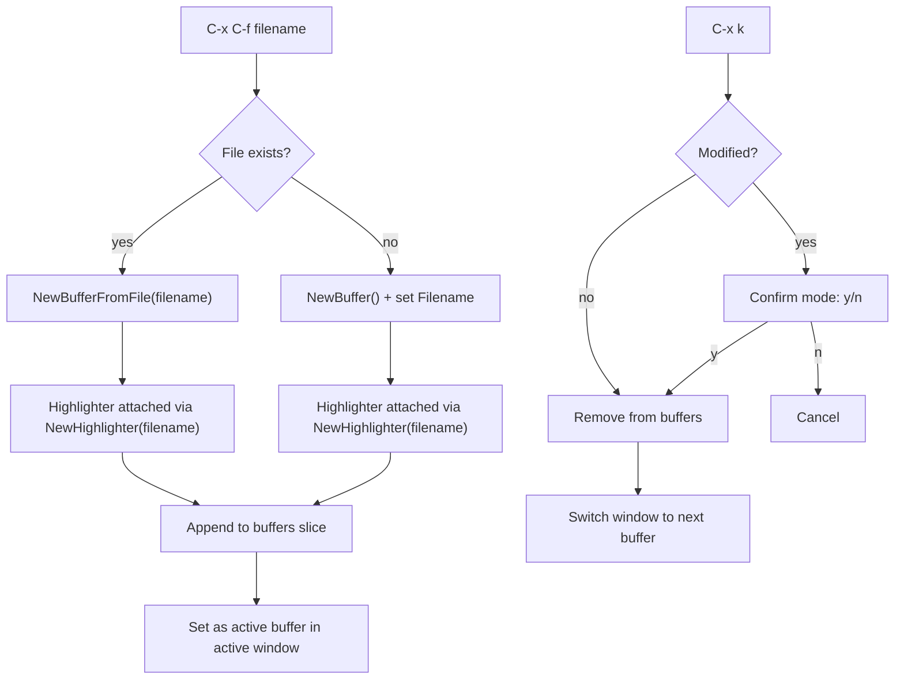
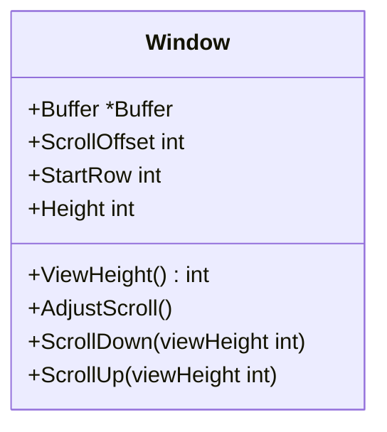
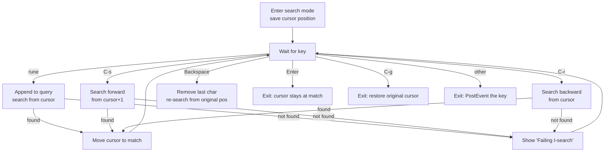
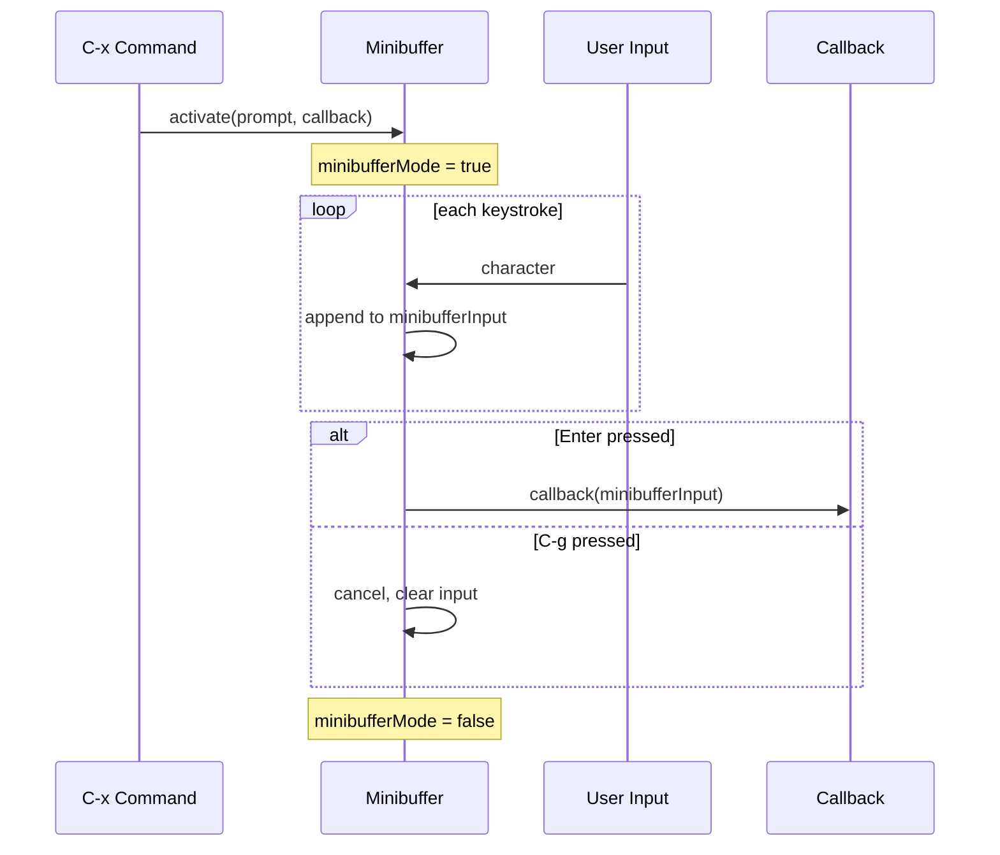
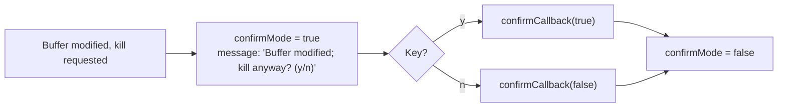
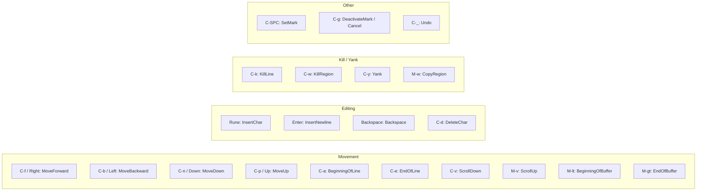
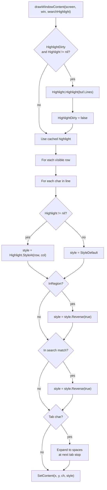

# Event Loop, Window Management, and UI Rendering

The event loop in `main.go` is the central coordinator of goomacs. It polls terminal events, dispatches them through a priority-based mode system, manages multiple buffers and windows, and triggers screen rendering with syntax highlighting.

## Event Loop State Machine

The event loop operates as a state machine with five modes, checked in priority order:



### Mode Priority

Modes are checked in this order during key dispatch:



### State Variables

| Variable | Type | Purpose |
|----------|------|---------|
| `buffers` | `[]*Buffer` | All open buffers |
| `activeBufferIdx` | `int` | Index of current buffer |
| `previousBufferIdx` | `int` | Previous buffer (for C-x b default) |
| `windows` | `[]*Window` | All open windows |
| `activeWindowIdx` | `int` | Index of active window |
| `prefixCx` | `bool` | Waiting for second key after C-x |
| `searchMode` | `bool` | In incremental search |
| `searchForward` | `bool` | Forward vs backward search direction |
| `searchQuery` | `[]rune` | Characters typed in search |
| `searchOrigR/C` | `int` | Cursor before search (for C-g cancel) |
| `searchMatchR/C` | `int` | Current match position |
| `searchHasMatch` | `bool` | Whether query matches |
| `minibufferMode` | `bool` | In minibuffer text input |
| `minibufferPrompt` | `string` | Prompt text (e.g., "Find file: ") |
| `minibufferInput` | `string` | User input so far |
| `minibufferCallback` | `func(string)` | Called on Enter with input |
| `confirmMode` | `bool` | Waiting for y/n confirmation |
| `confirmCallback` | `func(bool)` | Called with true (y) or false (n) |
| `message` | `string` | Message displayed on bottom line |

## Multi-Buffer Management



### Buffer Commands (via C-x prefix)

| Sequence | Command | Behavior |
|----------|---------|----------|
| `C-x C-f` | find-file | Minibuffer prompt for filename; loads or creates buffer; attaches Highlighter |
| `C-x b` | switch-buffer | Minibuffer prompt with default = previous buffer name |
| `C-x k` | kill-buffer | Minibuffer prompt; confirms if modified; switches to next buffer |
| `C-x C-b` | list-buffers | Creates `*Buffer List*` buffer showing all open buffers |
| `C-x C-s` | save | Saves current buffer; prompts for filename if none set |
| `C-x C-c` | quit | Warns once on modified buffers; second press quits |

### Buffer Lifecycle



## Window Management

### Window Struct



- `ViewHeight()` returns `Height - 1` (reserves 1 row for the status line)
- `AdjustScroll()` ensures the buffer's cursor is visible within this window's viewport
- `ScrollDown()`/`ScrollUp()` implements page movement, adjusting cursor if needed

### Window Layout

```
┌──────────────────────────────────┐
│  Window 0  (StartRow=0, H=12)   │
│  ... buffer content ...         │
│  == main.go [Mod]  L5/100 C3 ==│  ← active status (reverse video)
├──────────────────────────────────┤
│  Window 1  (StartRow=12, H=12)  │
│  ... buffer content ...         │
│  -- buffer.go       L1/50 C0 --│  ← inactive status (dashes)
├──────────────────────────────────┤
│  message line                    │  ← shared, last row
└──────────────────────────────────┘
```

`recalcWindows()` distributes rows evenly:
```
available = screenHeight - 1   (reserve 1 for message line)
baseH     = available / len(windows)
extra     = available % len(windows)
```
First `extra` windows get `baseH + 1` rows; the rest get `baseH`.

### Window Commands (via C-x prefix)

| Sequence | Command | Behavior |
|----------|---------|----------|
| `C-x 2` | split-window | Creates a new window with the same buffer; recalculates layout |
| `C-x o` | other-window | Cycles `activeWindowIdx` to next window |
| `C-x 0` | delete-window | Closes current window (must have >1); recalculates layout |
| `C-x 1` | delete-other-windows | Keeps only active window; recalculates layout |

### Scroll Isolation

When multiple windows display the same buffer, each window maintains its own `ScrollOffset`. In `redraw()`, `AdjustScroll()` is only called for the active window:

```go
for i, win := range windows {
    if i == activeWindowIdx {
        win.AdjustScroll()
    }
    // ... draw window content ...
}
```

This prevents scroll bleeding: scrolling in one window does not affect the other window's viewport, even when they share the same buffer.

## Search Mode

When the user presses C-s or C-r, the editor enters incremental search mode. Each keystroke updates the search query and immediately finds the next match.



**Key behavior**: When an unrecognized key is pressed during search, the editor exits search mode and re-posts the event via `screen.PostEvent(ev)` so it gets handled as a normal command.

## Minibuffer Mode

The minibuffer provides a generic text input prompt used by several commands:



Used by: `C-x C-f` (find-file), `C-x b` (switch-buffer), `C-x k` (kill-buffer), `C-x C-s` (save with no filename).

## Confirm Mode

For destructive operations, the editor enters confirm mode with a y/n prompt:



## Normal Mode Key Dispatch



**Important**: All editing operations call `buf.SaveUndo()` before the operation. Non-kill keys call `buf.ClearLastKill()` to reset the consecutive-kill tracker.

### Alt Key Handling

Alt+key combinations are handled in two ways:

1. **ModAlt flag** -- The terminal layer detects `ESC + key` within 50ms and delivers a `KeyRune` event with `ModAlt` set.
2. **Bare ESC fallback** -- If the terminal delivers a bare `KeyEsc`, the event loop manually calls `PollEvent()` again to read the next key.

## Rendering Pipeline

### Screen Layout (single window)

```
Row 0 to (height-3):   Text area (buffer content)
Row height-2:           Status line (reverse video)
Row height-1:           Message line
```

### Screen Layout (split windows)

```
Row 0 to win0.Height-2:        Window 0 text area
Row win0.Height-1:              Window 0 status line
Row win0.Height to ...:         Window 1 text area
...
Row screenHeight-1:             Shared message line
```

### drawWindowContent

The main rendering function for each window. Integrates syntax highlighting:



Region and search highlighting apply reverse video **on top of** the syntax highlight style, preserving foreground/background colors while making the selection visible.

### Tab Expansion

Tabs are stored as literal `\t` in the buffer but displayed as spaces aligned to 8-column tab stops.

```go
const tabWidth = 8

func bufColToVisualCol(line []rune, bufCol int) int {
    visualCol := 0
    for i := 0; i < bufCol && i < len(line); i++ {
        if line[i] == '\t' {
            visualCol += tabWidth - (visualCol % tabWidth)
        } else {
            visualCol++
        }
    }
    return visualCol
}
```

### drawWindowStatusLine

Each window has its own status line. Active vs inactive windows use different styles:

| Element | Active Window | Inactive Window |
|---------|--------------|-----------------|
| Border chars | `==` | `--` |
| Left side | `== filename [Modified]` | `-- filename [Modified]` |
| Right side | `Line R/Total, Col C ==` | `Line R/Total, Col C --` |

Both are rendered in reverse video.

### drawMessageLine

Renders on the last row of the screen (shared across all windows). Shows contextual information:

| Context | Message |
|---------|---------|
| C-x prefix | `"C-x-"` |
| Search (found) | `"I-search: query"` or `"I-search backward: query"` |
| Search (failed) | `"Failing I-search: query"` |
| Minibuffer | `"prompt: input"` with cursor |
| Confirm | `"Buffer modified; kill anyway? (y/n)"` |
| After action | `"Mark set"`, `"Saved filename"`, `"Quit"`, etc. |

### Redraw Closure

The `redraw()` function is defined as a closure inside `main()`:

```
1. screen.Clear()
2. For each window:
   a. AdjustScroll() (active window only)
   b. drawWindowContent(screen, win, searchHighlight)
   c. drawWindowStatusLine(screen, win, isActive)
3. drawMessageLine(message)           — or minibuffer/confirm prompt
4. ShowCursor(visualX, screenY)       — position hardware cursor
5. Show()                             — flush to terminal (diff-based)
```

This is called after every key event and resize event.

## Complete Event Processing Flow

```mermaid
sequenceDiagram
    participant Term as Terminal
    participant Loop as Event Loop
    participant Buf as Buffer
    participant HL as Highlighter
    participant Screen as Screen

    Loop->>Term: PollEvent()
    Term-->>Loop: KeyEvent (e.g., 'x')

    Loop->>Loop: dispatch by mode priority
    Loop->>Buf: SaveUndo()
    Loop->>Buf: InsertChar('x')
    Buf->>Buf: modify Lines, advance cursor
    Buf->>Buf: HighlightDirty = true

    Loop->>Screen: Clear()
    Note over Loop: for each window:
    Loop->>HL: check HighlightDirty
    alt dirty
        Loop->>HL: Highlight(buf.Lines)
    end
    Loop->>HL: StyleAt(row, col) per cell
    Loop->>Screen: SetContent(x, y, ch, style)
    Loop->>Screen: ShowCursor(x, y)
    Loop->>Screen: Show()
    Screen->>Screen: diff and output<br/>256-color ANSI
```
