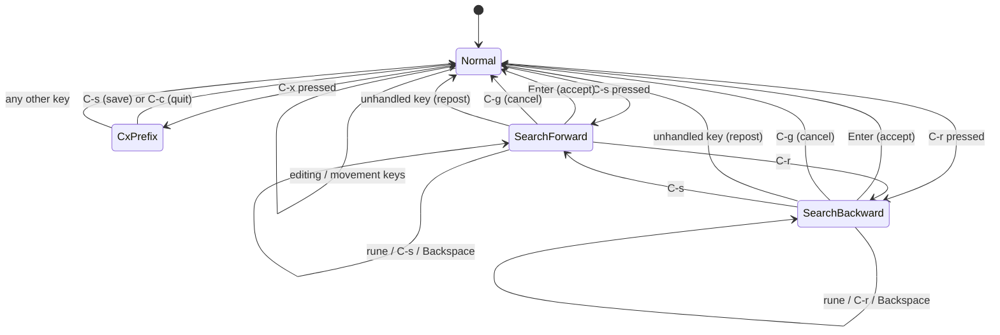
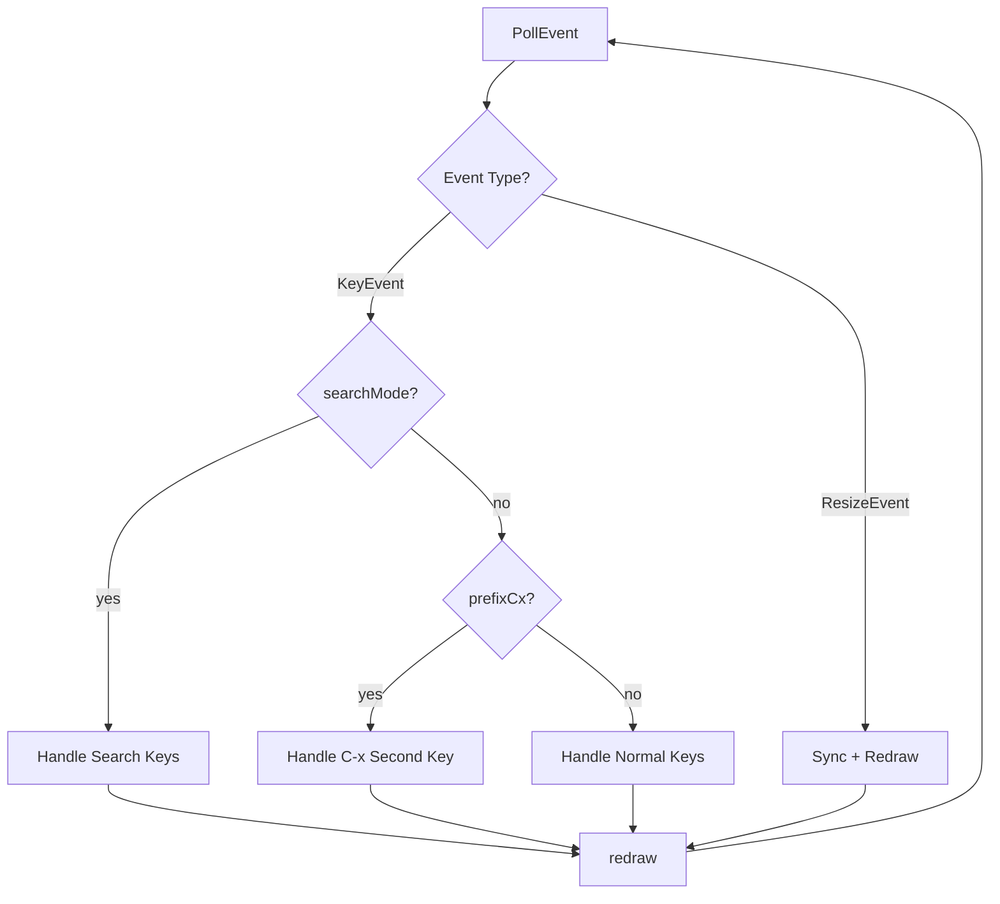
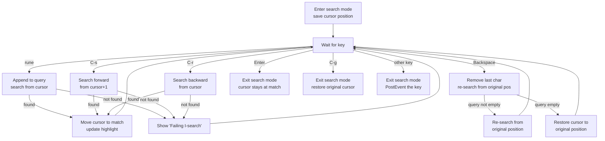
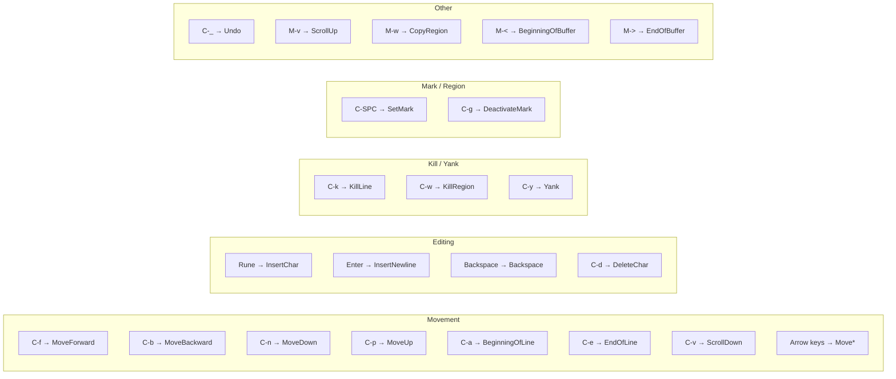
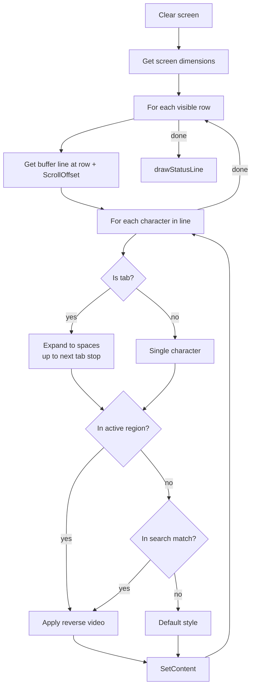

# Event Loop and UI Rendering

The event loop in `main.go` is the central coordinator of goomacs. It polls terminal events, dispatches them to buffer operations, and triggers screen rendering.

## Event Loop State Machine

The event loop operates as a state machine with three modes: **Normal**, **Search**, and **C-x Prefix**.



### State Variables

| Variable | Type | Purpose |
|----------|------|---------|
| `prefixCx` | `bool` | True when waiting for second key after C-x |
| `searchMode` | `bool` | True when in incremental search |
| `searchForward` | `bool` | True for forward search, false for backward |
| `searchQuery` | `[]rune` | Characters typed in search mode |
| `searchOrigR/C` | `int` | Cursor position before search started (for C-g cancel) |
| `searchMatchR/C` | `int` | Position of current match (for highlighting) |
| `searchHasMatch` | `bool` | Whether current query matches any text |
| `quitWarned` | `bool` | True after first C-x C-c on unsaved buffer |
| `message` | `string` | Message displayed on the bottom line |

## Main Loop Structure



## Search Mode

When the user presses C-s or C-r, the editor enters incremental search mode. Each keystroke updates the search query and immediately finds the next match.



**Key behavior**: When an unrecognized key is pressed during search, the editor exits search mode and re-posts the event via `screen.PostEvent(ev)` so it gets handled as a normal command. This ensures keys like C-a or C-e work seamlessly when pressed during a search.

## C-x Prefix Commands

The C-x prefix creates a two-key command sequence:

| Sequence | Action |
|----------|--------|
| C-x C-s | Save file to disk |
| C-x C-c | Quit (with unsaved-changes warning) |

The quit logic uses `quitWarned`:
1. First C-x C-c on a modified buffer shows a warning message
2. Second C-x C-c confirms and exits
3. `quitWarned` resets on any key that is not C-x

## Normal Mode Key Dispatch



**Important**: All editing operations (InsertChar, InsertNewline, Backspace, DeleteChar, KillLine, KillRegion, Yank) call `buf.SaveUndo()` before the operation. Non-kill keys call `buf.ClearLastKill()` to reset the consecutive-kill tracker.

### Alt Key Handling

Alt+key combinations are handled in two ways:

1. **ModAlt flag** -- The terminal layer detects `ESC + key` within 50ms and delivers a `KeyRune` event with `ModAlt` set. The event loop checks `ev.Modifiers() & term.ModAlt`.

2. **Bare ESC fallback** -- If the terminal delivers a bare `KeyEsc` (timeout expired), the event loop manually calls `PollEvent()` again to read the next key. This handles terminals that send ESC and the key as separate events with a delay.

## Rendering Pipeline

### Screen Layout

```
Row 0 to (height-3):   Text area (buffer content)
Row height-2:           Status line (reverse video)
Row height-1:           Message line
```

`textAreaHeight(screenHeight)` returns `max(screenHeight - 2, 1)`.

### drawBufferWithSearch

The main rendering function iterates through visible lines:



### Tab Expansion

Tabs are stored as literal `\t` in the buffer but displayed as spaces aligned to 8-column tab stops.

```go
const tabWidth = 8

func bufColToVisualCol(line []rune, bufCol int) int {
    visualCol := 0
    for i := 0; i < bufCol && i < len(line); i++ {
        if line[i] == '\t' {
            visualCol += tabWidth - (visualCol % tabWidth)
        } else {
            visualCol++
        }
    }
    return visualCol
}
```

This function is used to position the hardware cursor correctly when the line contains tabs.

### drawStatusLine

Renders on the second-to-last row in reverse video:

```
 filename.go [Modified]                    Line 42/100, Col 15
```

- Left side: filename and modification indicator
- Right side: current line / total lines, column number

### drawMessageLine

Renders on the last row in normal style. Shows:
- `"C-x-"` during C-x prefix
- `"I-search: query"` during search
- `"Mark set"`, `"Region copied"`, `"Saved filename"`, etc.
- `"Quit"` after C-g
- Empty string clears the line

### Redraw Closure

The `redraw()` function is defined as a closure inside `main()`:

```
1. AdjustScroll(viewHeight)       — ensure cursor is visible
2. drawBufferWithSearch(...)      — render text with highlighting
3. drawMessageLine(message)       — render message
4. ShowCursor(visualX, screenY)   — position hardware cursor
5. Show()                         — flush to terminal (diff-based)
```

This is called after every key event and resize event.

## Complete Event Processing Flow

```mermaid
sequenceDiagram
    participant Term as Terminal
    participant Loop as Event Loop
    participant Buf as Buffer
    participant Screen as Screen Rendering

    Loop->>Term: PollEvent()
    Term-->>Loop: KeyEvent (e.g., 'x')

    Loop->>Loop: clear message
    Loop->>Loop: ClearLastKill (non-kill key)
    Loop->>Buf: SaveUndo()
    Loop->>Buf: InsertChar('x')
    Buf->>Buf: modify Lines, advance cursor

    Loop->>Buf: AdjustScroll(viewHeight)
    Loop->>Screen: Clear()
    Loop->>Screen: SetContent(...) for each cell
    Loop->>Screen: ShowCursor(visualCol, screenRow)
    Loop->>Screen: Show()
    Screen->>Screen: diff and output ANSI
```
