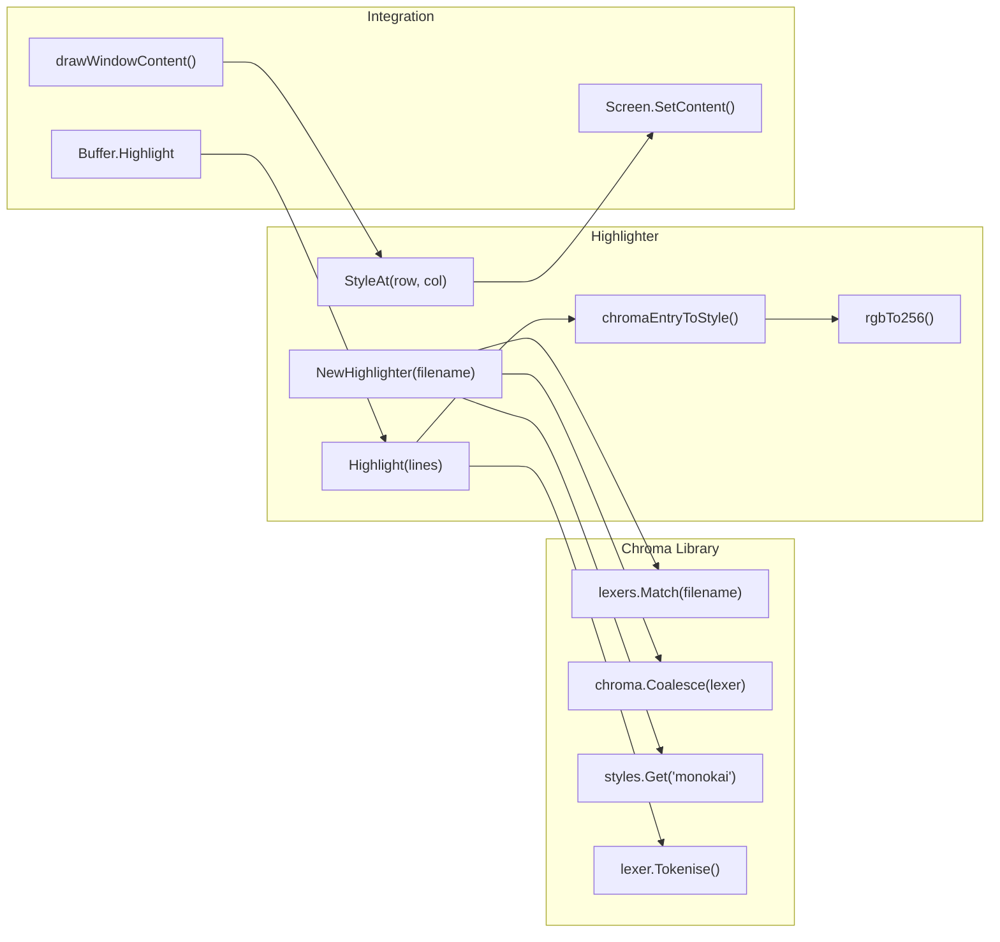
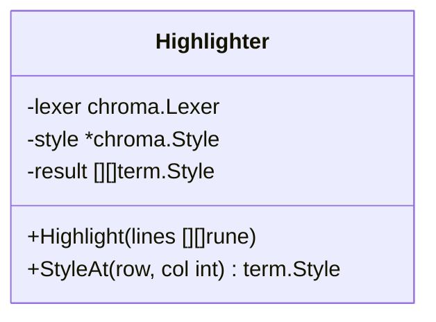
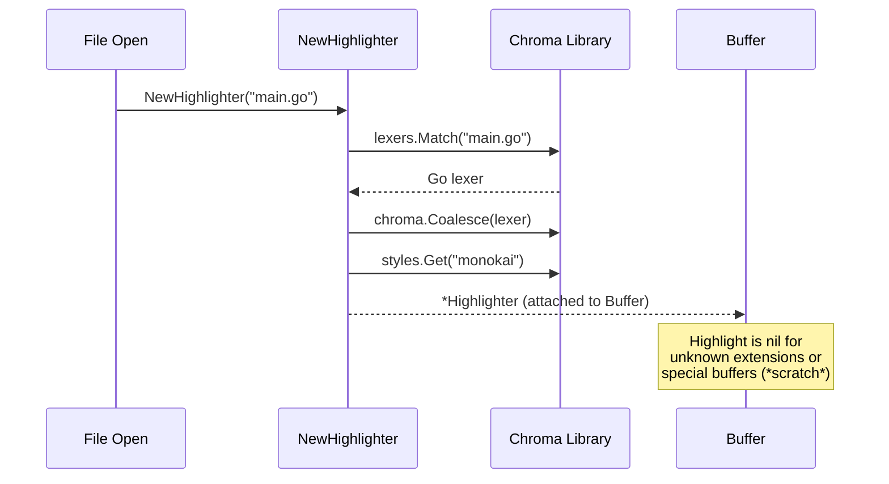
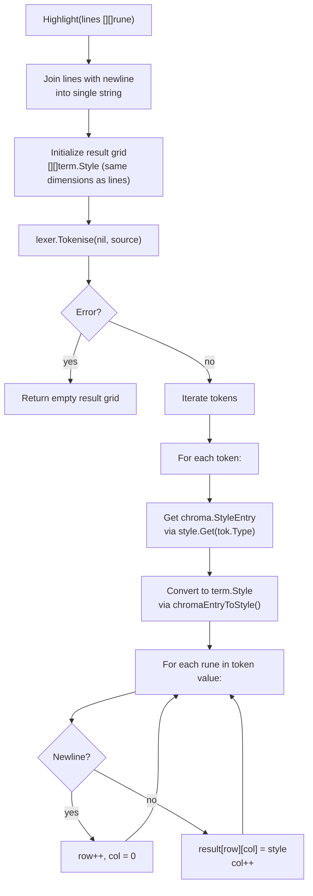
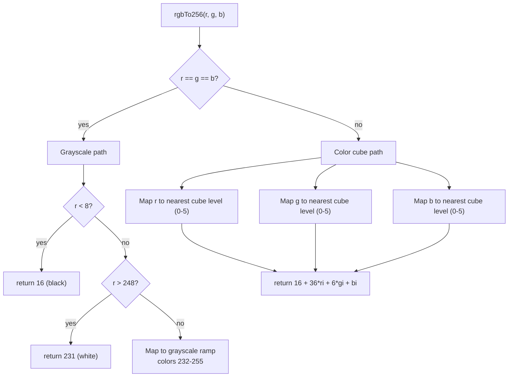
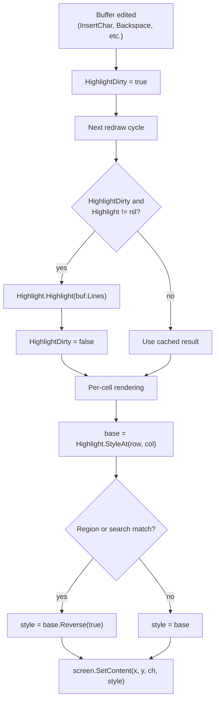

# Syntax Highlighting (highlight.go)

The `Highlighter` in `highlight.go` provides syntax coloring for source code buffers using the [Chroma](https://github.com/alecthomas/chroma) lexer library with the monokai theme and 256-color ANSI output.

## Architecture



## Highlighter Struct



- `lexer` -- Chroma lexer matched by filename extension (e.g., Go lexer for `.go` files). Wrapped with `chroma.Coalesce()` for token merging.
- `style` -- Chroma theme object (`monokai`). Maps token types to colors.
- `result` -- Cached 2D grid of `term.Style` values, one per character in the buffer. Re-computed on each `Highlight()` call.

## Lifecycle



## Tokenization Flow



## Color Conversion

Chroma provides colors as RGB values. The terminal uses 256-color ANSI palette indices. The conversion is done manually since Chroma v2 lacks a `Nearest256()` method.

### 256-Color Palette Structure

```
Colors   0-7:    Standard colors (black, red, green, etc.)
Colors   8-15:   Bright/high-intensity colors
Colors  16-231:  6x6x6 RGB color cube
Colors 232-255:  Grayscale ramp (24 shades)
```

### RGB to 256-Color Conversion



### Color Cube Index Mapping

The 6x6x6 cube uses these levels: `[0, 95, 135, 175, 215, 255]`.

`colorCubeIndex(v)` finds the nearest level by absolute distance:

| Input Range | Nearest Level | Index |
|-------------|---------------|-------|
| 0-47 | 0 | 0 |
| 48-114 | 95 | 1 |
| 115-154 | 135 | 2 |
| 155-194 | 175 | 3 |
| 195-234 | 215 | 4 |
| 235-255 | 255 | 5 |

## Style Conversion

`chromaEntryToStyle()` converts a Chroma `StyleEntry` to a `term.Style`:

| Chroma Property | Mapping | Notes |
|----------------|---------|-------|
| `entry.Colour` | `term.Style.Foreground(Color(rgbTo256(...)))` | Only if `Colour.IsSet()` is true |
| `entry.Bold` | `term.Style.Bold(true)` | Only if `entry.Bold == chroma.Yes` (tristate: Yes/No/Pass) |
| `entry.Background` | Not mapped | Background colors from the theme are intentionally ignored |

## Integration with Buffer and Rendering



- Buffers without a matching lexer (`.txt`, unknown extensions) have `Highlight == nil` and render with `StyleDefault` (terminal default color).
- Special buffers (`*scratch*`, `*Buffer List*`) never have a Highlighter.
- Region and search highlighting overlay reverse video on top of syntax colors, preserving the foreground/background.

## Supported Languages

All languages supported by Chroma are available automatically. Language detection is based on filename extension via `lexers.Match()`. Common examples:

| Extension | Language |
|-----------|----------|
| `.go` | Go |
| `.py` | Python |
| `.js`, `.ts` | JavaScript, TypeScript |
| `.rs` | Rust |
| `.c`, `.h` | C |
| `.cpp`, `.cc` | C++ |
| `.java` | Java |
| `.rb` | Ruby |
| `.sh`, `.bash` | Bash |
| `.html` | HTML |
| `.css` | CSS |
| `.json` | JSON |
| `.yaml`, `.yml` | YAML |
| `.md` | Markdown |
| `.sql` | SQL |
