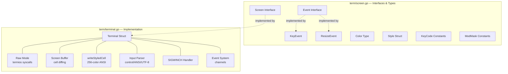
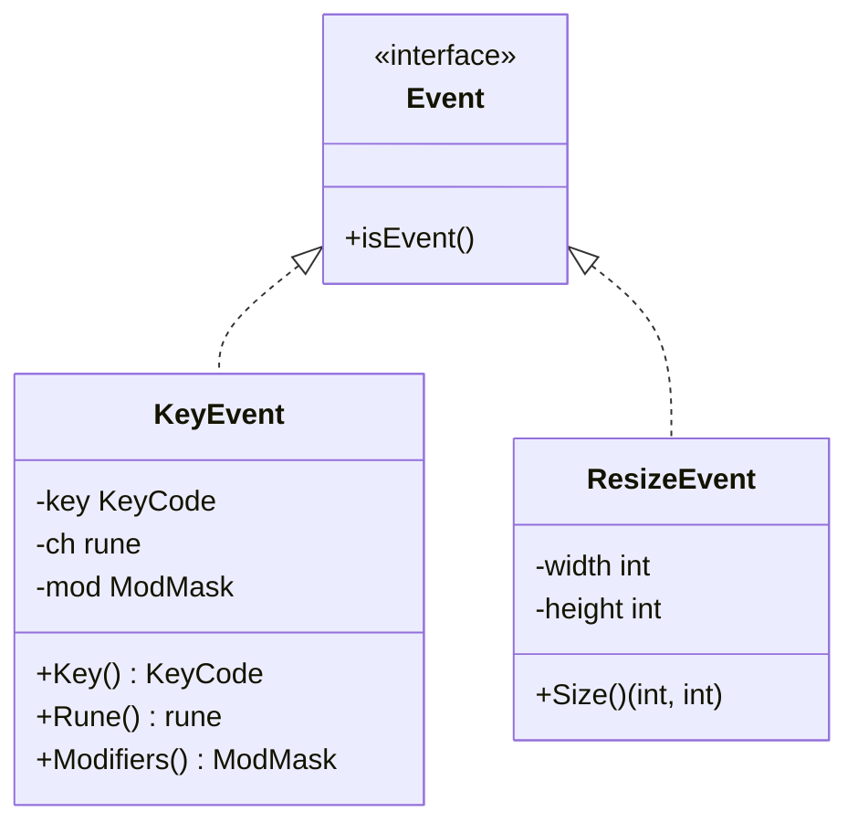
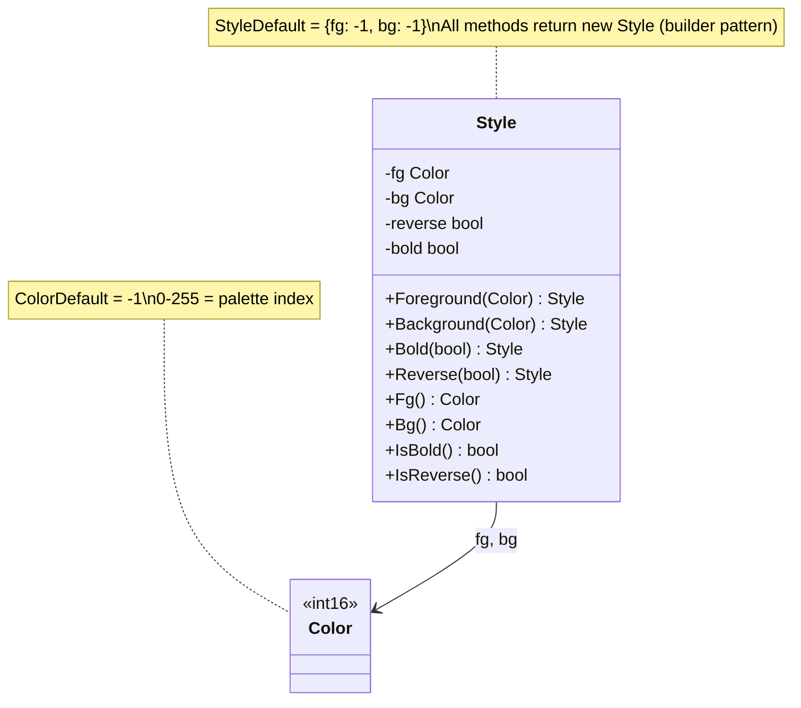
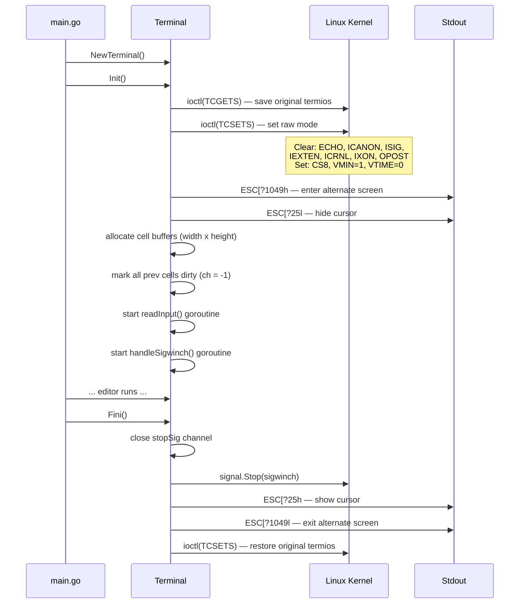
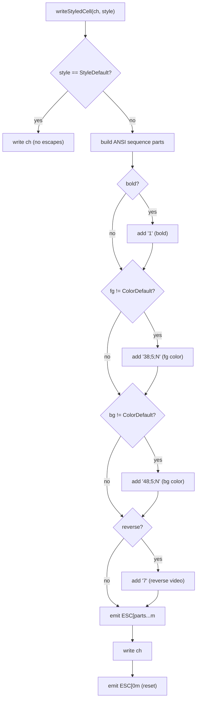
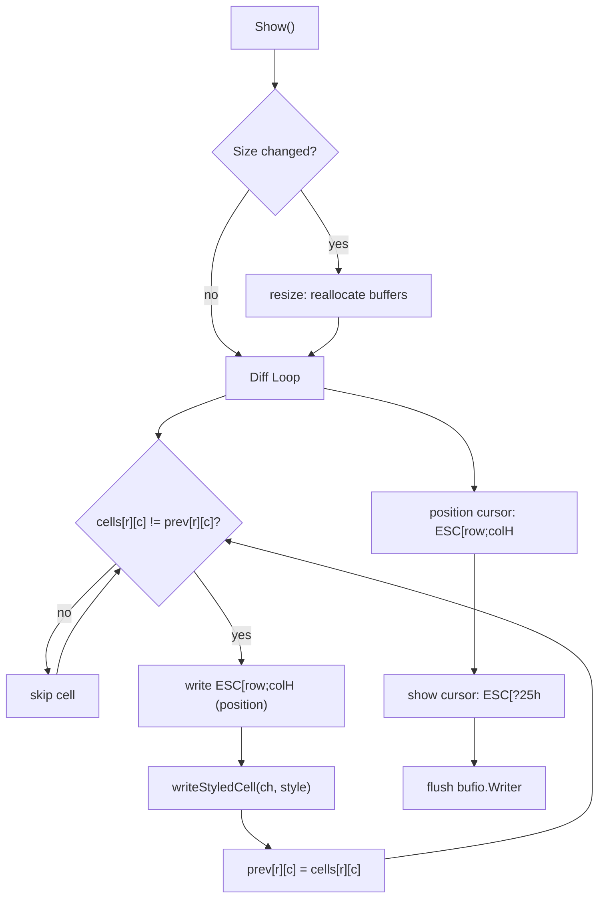
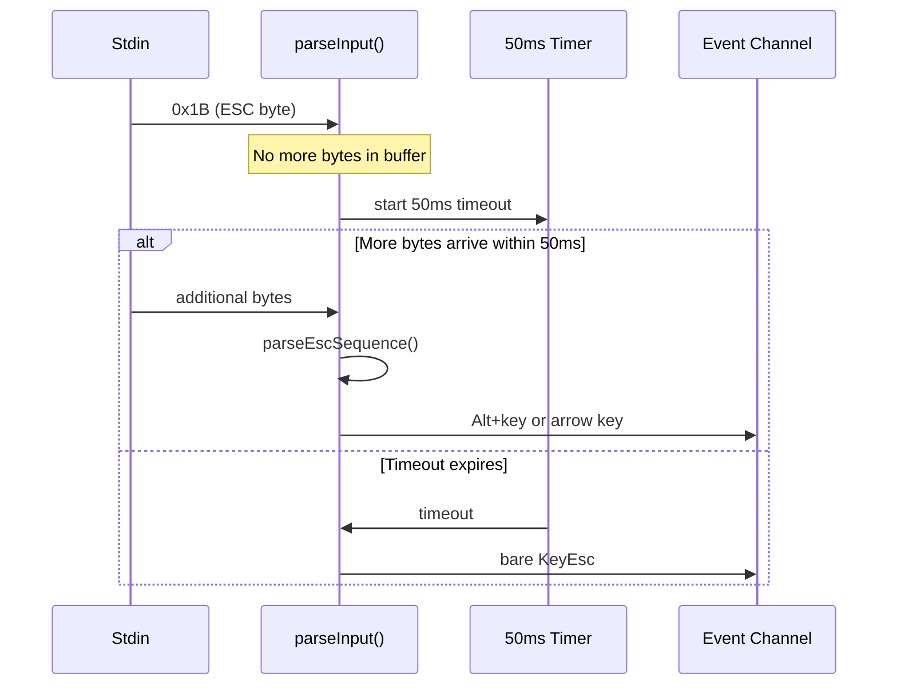
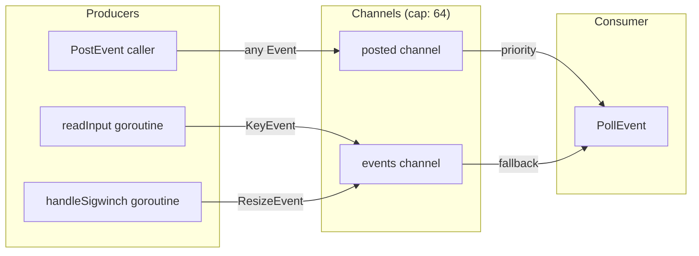
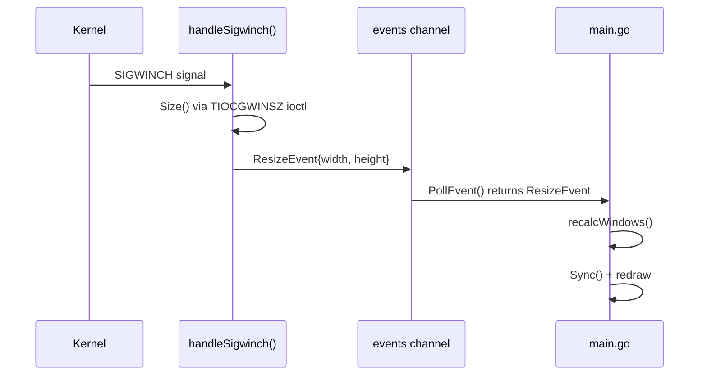

# Terminal Backend (term package)

The `term/` package provides a pure Go terminal I/O layer using ANSI/VT100 escape sequences and Linux syscalls, with 256-color rendering support.

## Package Structure



## Screen Interface

```go
type Screen interface {
    Init() error
    Fini()
    Size() (width, height int)
    PollEvent() Event
    PostEvent(Event)
    Clear()
    SetContent(x, y int, ch rune, style Style)
    Show()
    ShowCursor(x, y int)
    Sync()
}
```

This is the only abstraction boundary in the terminal layer. All rendering and input code in `main.go` depends on this interface, not on the concrete `Terminal` struct.

## Key Types

### Event Hierarchy



### Color and Style

The `Style` type is a struct supporting 256-color foreground/background, reverse video, and bold:



- `Color` is `int16`. `-1` (`ColorDefault`) means use the terminal's default color. Values 0-255 map to the 256-color ANSI palette.
- `Style` is a value type (struct). All methods return a new `Style` (builder pattern).
- `StyleDefault` is a `var` (not `const`, since Go structs can't be const): `Style{fg: ColorDefault, bg: ColorDefault}`.
- Go struct `==` comparison works for all fields, so the cell diffing in `Show()` works without custom logic.

### KeyCode Constants

Key codes start at 256 to leave 0-255 for ASCII. Notable constants:

| Constant | Value Range | Input |
|----------|-------------|-------|
| `KeyRune` | 256 | printable chars |
| `KeyCtrlA`..`KeyCtrlZ` | 259-284 | 0x01-0x1A |
| `KeyCtrlSpace` | 285 | 0x00 |
| `KeyCtrlUnderscore` | 286 | 0x1F |
| `KeyEnter` | 287 | 0x0D |
| `KeyBackspace` / `KeyBackspace2` | 288-289 | 0x08 / 0x7F |
| `KeyEsc` | 290 | 0x1B |
| `KeyUp/Down/Left/Right` | 291-294 | ESC [ A/B/C/D |
| `KeyTab` | 295 | 0x09 |

## Terminal Initialization



### Raw Mode Flags

| Category | Flags Cleared | Purpose |
|----------|--------------|---------|
| Input (`Iflag`) | `BRKINT`, `ICRNL`, `INPCK`, `ISTRIP`, `IXON` | Disable break, CR-to-NL, parity, stripping, flow control |
| Output (`Oflag`) | `OPOST` | Disable output processing |
| Control (`Cflag`) | -- (sets `CS8`) | 8-bit characters |
| Local (`Lflag`) | `ECHO`, `ICANON`, `IEXTEN`, `ISIG` | Disable echo, canonical mode, extended input, signals |

## Screen Rendering

### Cell Buffer Architecture

```
cells[height][width]  ← current frame
prev[height][width]   ← previous frame (for diffing)

Each cell: { ch rune, style Style }
```

### 256-Color ANSI Rendering

The `writeStyledCell()` method on `Terminal` is the single source of truth for converting a `Style` into ANSI escape sequences:



All attributes are combined into a single `\033[...m` sequence with semicolon separators. After the character, `\033[0m` resets all attributes. Default-styled cells emit no escape sequences.

### ANSI Escape Sequence Summary

| Sequence | Purpose |
|----------|---------|
| `ESC[?1049h` / `ESC[?1049l` | Enter / exit alternate screen buffer |
| `ESC[?25h` / `ESC[?25l` | Show / hide cursor |
| `ESC[row;colH` | Position cursor (1-based coordinates) |
| `ESC[1m` | Bold |
| `ESC[7m` | Reverse video |
| `ESC[38;5;Nm` | Set foreground to 256-color palette index N |
| `ESC[48;5;Nm` | Set background to 256-color palette index N |
| `ESC[0m` | Reset all attributes |

### Show() Diff Pipeline



**Key optimization**: Only changed cells produce output. The `prev` buffer tracks what was last rendered. On `Sync()`, all `prev` cells are set to `ch = -1` (sentinel), forcing a full redraw on the next `Show()`.

## Keyboard Input Parsing

### Parser Architecture


### Escape Key Timeout

Distinguishing a bare Escape press from an Alt+key or ANSI sequence:



The timeout is set to 50ms (`escTimeout`), which works well for local and SSH sessions.

## Event System

### Channel Architecture



### PollEvent Priority

```go
func (t *Terminal) PollEvent() Event {
    // Fast path: check posted channel (non-blocking)
    select {
    case ev := <-t.posted:
        return ev
    default:
    }
    // Slow path: wait for either channel
    select {
    case ev := <-t.posted:
        return ev
    case ev := <-t.events:
        return ev
    }
}
```

Posted events (from `PostEvent()`) always take priority over stdin/resize events. This is used by the search mode exit logic in `main.go`, which re-posts the key event that triggered the exit so it can be processed as a normal command.

## Resize Handling



- `SIGWINCH` is caught via `os/signal.Notify()`
- The handler goroutine queries the new terminal size using the `TIOCGWINSZ` ioctl
- A `ResizeEvent` is posted to the events channel
- The event loop calls `recalcWindows()` to redistribute window heights, then `Sync()` (marks all cells dirty) and redraws

## Test Infrastructure

Tests use dependency injection to avoid real terminal I/O:

- **`newTestTerminal()`** -- Creates a `Terminal` with pre-allocated channels and buffers, no `Init()` syscall needed.
- **`Terminal.in` field** -- Accepts any `io.Reader`, allowing tests to inject `bytes.Reader` instead of `os.Stdin`.
- **`showForTest()`** -- Test-only version of `Show()` that skips the `Size()` ioctl call. Uses `writeStyledCell()` for consistent rendering logic.
- **`drainEvents()`** -- Non-blocking drain of all queued events for assertion.
- **`parseInput()`** -- Can be called directly (no goroutine needed) for unit testing input parsing.

26 tests cover:
- Control character parsing (Ctrl-A through Ctrl-Z, Ctrl-Space, Ctrl-Underscore)
- Special keys (Enter, Backspace, Tab, Escape)
- ANSI arrow key sequences (Up, Down, Left, Right)
- UTF-8 multi-byte rune decoding
- Alt+key modifier detection
- Screen buffer operations (SetContent, Clear)
- Cell diffing and selective output
- 256-color foreground/background ANSI output
- Bold attribute rendering
- Reverse video style
- Combined style attributes (bold + fg + bg + reverse in one sequence)
- PostEvent priority over stdin events
- Sync dirty marking for full redraw
