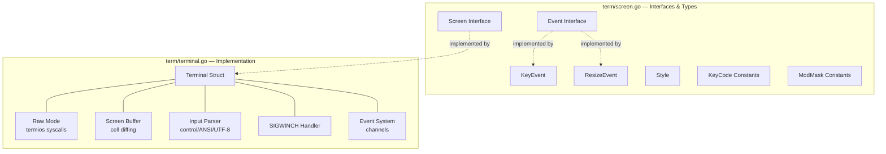
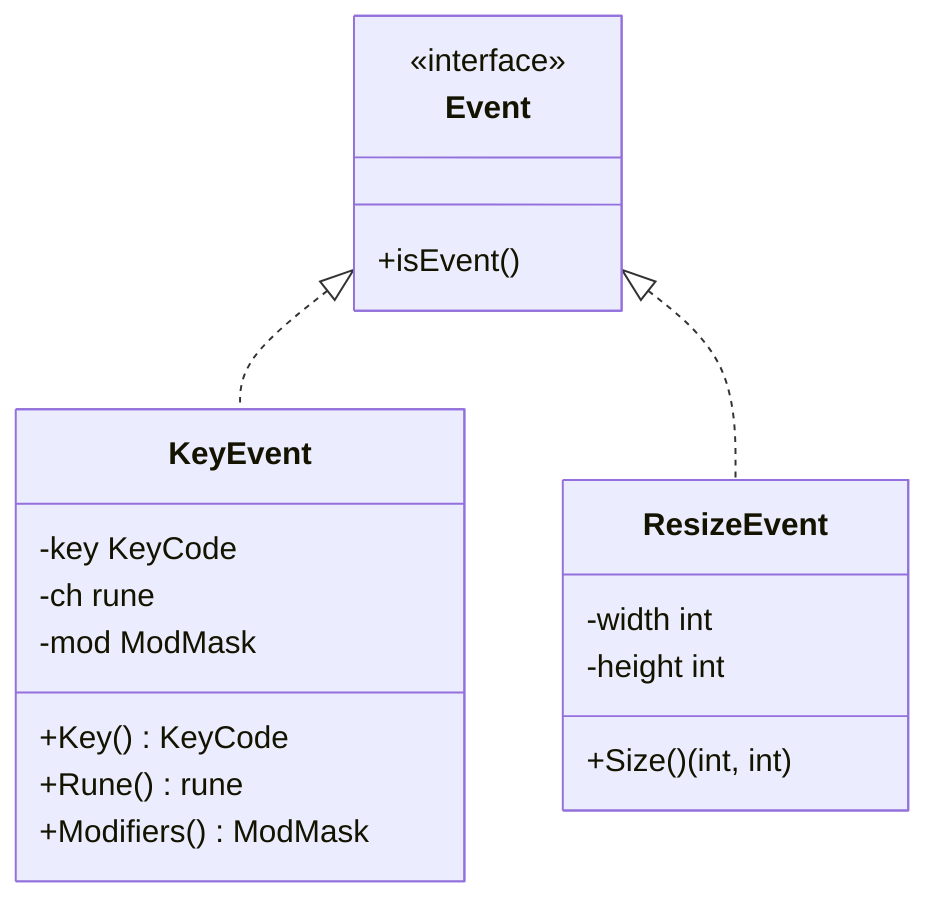
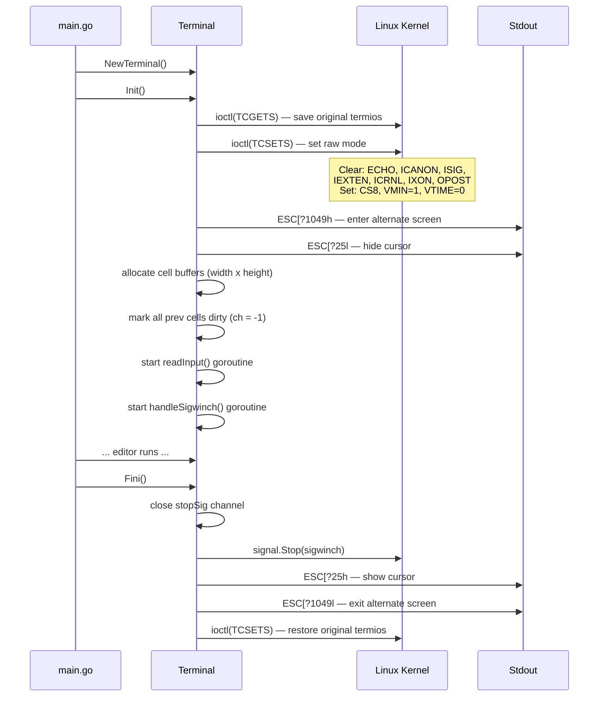
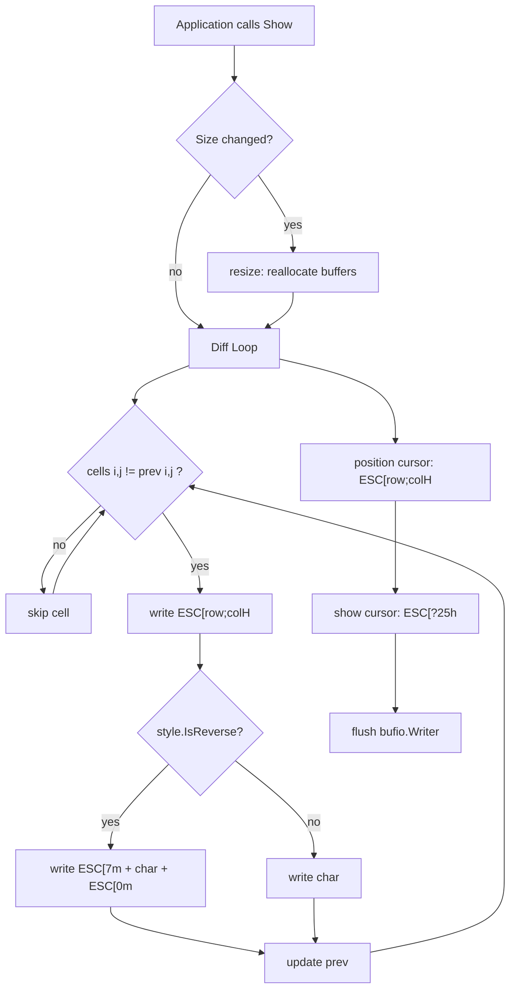
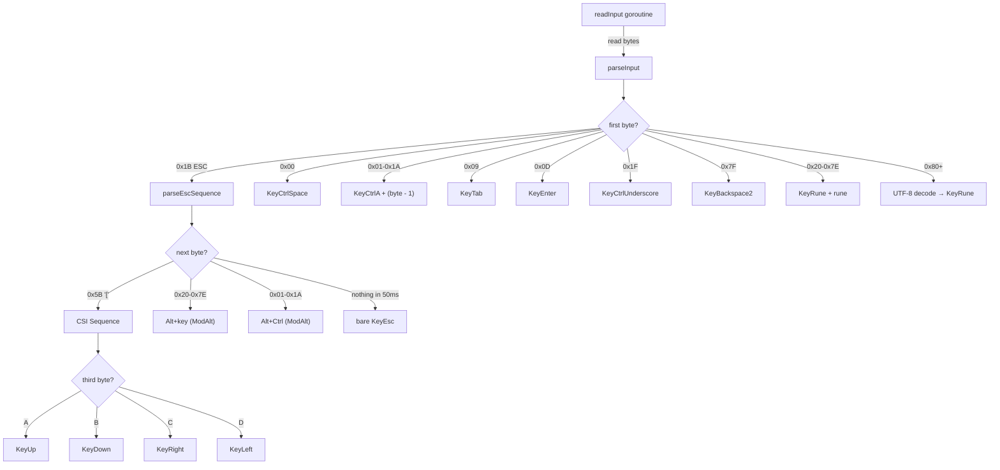
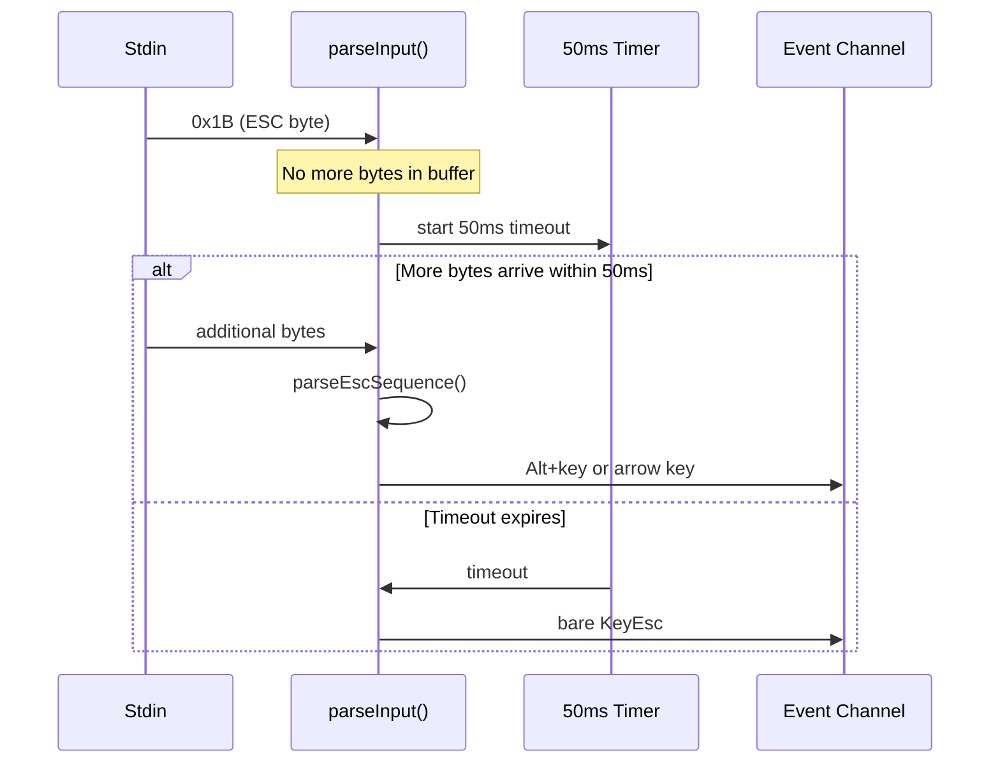
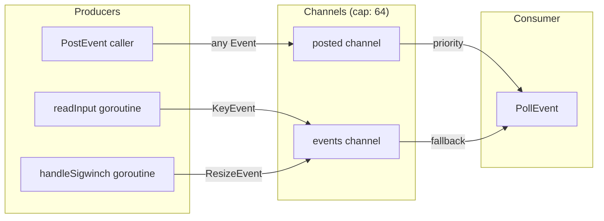
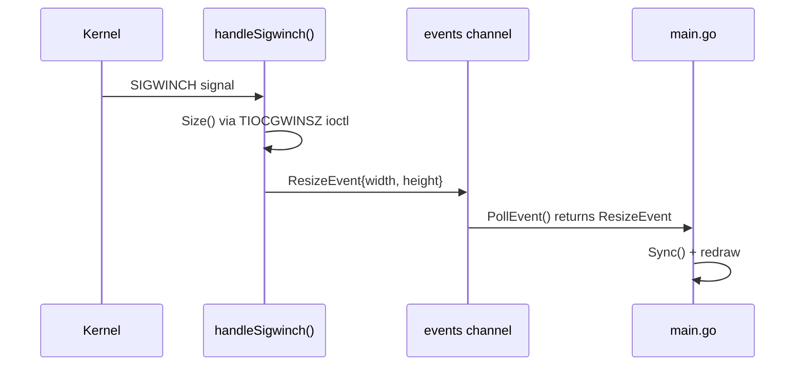

# Terminal Backend (term package)

The `term/` package provides a pure Go terminal I/O layer using ANSI/VT100 escape sequences and Linux syscalls. It replaces the previous `tcell` dependency, achieving zero external dependencies.

## Package Structure



## Screen Interface

```go
type Screen interface {
    Init() error
    Fini()
    Size() (width, height int)
    PollEvent() Event
    PostEvent(Event)
    Clear()
    SetContent(x, y int, ch rune, style Style)
    Show()
    ShowCursor(x, y int)
    Sync()
}
```

This is the only abstraction boundary in the terminal layer. All rendering and input code in `main.go` depends on this interface, not on the concrete `Terminal` struct.

## Key Types

### Event Hierarchy



### Style

A `uint8` bitmask. Currently only supports reverse video (bit 0).

```go
StyleDefault = Style(0)       // normal text
style.Reverse(true)           // reverse video on
style.Reverse(false)          // reverse video off
style.IsReverse() bool        // check flag
```

### KeyCode Constants

Key codes start at 256 to leave 0-255 for ASCII. Notable constants:

| Constant | Value | Byte(s) |
|----------|-------|---------|
| `KeyRune` | 256 | printable chars |
| `KeyNUL` | 257 | 0x00 |
| `KeyCtrlA`..`KeyCtrlZ` | 259-284 | 0x01-0x1A |
| `KeyCtrlSpace` | 285 | 0x00 (alias) |
| `KeyCtrlUnderscore` | 286 | 0x1F |
| `KeyEnter` | 287 | 0x0D |
| `KeyBackspace` | 288 | 0x08 |
| `KeyBackspace2` | 289 | 0x7F |
| `KeyEsc` | 290 | 0x1B |
| `KeyTab` | 291 | 0x09 |
| `KeyUp/Down/Left/Right` | 292-295 | ESC [ A/B/C/D |

## Terminal Initialization



### Raw Mode Flags

| Category | Flags Cleared | Purpose |
|----------|--------------|---------|
| Input (`Iflag`) | `BRKINT`, `ICRNL`, `INPCK`, `ISTRIP`, `IXON` | Disable break, CR-to-NL, parity, stripping, flow control |
| Output (`Oflag`) | `OPOST` | Disable output processing |
| Control (`Cflag`) | — (sets `CS8`) | 8-bit characters |
| Local (`Lflag`) | `ECHO`, `ICANON`, `IEXTEN`, `ISIG` | Disable echo, canonical mode, extended input, signals |

## Screen Rendering

### Cell Buffer Architecture

```
cells[height][width]  ← current frame
prev[height][width]   ← previous frame (for diffing)

Each cell: { ch rune, style Style }
```

### Rendering Pipeline



**Key optimization**: Only changed cells produce output. The `prev` buffer tracks what was last rendered. On `Sync()`, all `prev` cells are set to `ch = -1` (sentinel), forcing a full redraw on the next `Show()`.

### ANSI Escape Sequences Used

| Sequence | Purpose |
|----------|---------|
| `ESC[?1049h` / `ESC[?1049l` | Enter / exit alternate screen buffer |
| `ESC[?25h` / `ESC[?25l` | Show / hide cursor |
| `ESC[row;colH` | Position cursor (1-based coordinates) |
| `ESC[7m` | Enable reverse video |
| `ESC[0m` | Reset all attributes |

## Keyboard Input Parsing

### Parser Architecture



### Escape Key Timeout

Distinguishing a bare Escape press from an Alt+key or ANSI sequence:



The timeout is set to 50ms (`escTimeout`), which works well for local and SSH sessions.

## Event System

### Channel Architecture



### PollEvent Priority

```go
func (t *Terminal) PollEvent() Event {
    // Fast path: check posted channel (non-blocking)
    select {
    case ev := <-t.posted:
        return ev
    default:
    }
    // Slow path: wait for either channel
    select {
    case ev := <-t.posted:
        return ev
    case ev := <-t.events:
        return ev
    }
}
```

Posted events (from `PostEvent()`) always take priority over stdin/resize events. This is used by the search mode exit logic in `main.go`, which re-posts the key event that triggered the exit so it can be processed as a normal command.

## Resize Handling



- `SIGWINCH` is caught via `os/signal.Notify()`
- The handler goroutine queries the new terminal size using the `TIOCGWINSZ` ioctl (`0x5413`)
- A `ResizeEvent` is posted to the events channel
- The event loop calls `Sync()` (marks all cells dirty) then redraws

## Test Infrastructure

Tests use dependency injection to avoid real terminal I/O:

- **`newTestTerminal()`** -- Creates a `Terminal` with pre-allocated channels and buffers, no `Init()` syscall needed.
- **`Terminal.in` field** -- Accepts any `io.Reader`, allowing tests to inject `bytes.Reader` instead of `os.Stdin`.
- **`showForTest()`** -- Test-only version of `Show()` that skips the `Size()` ioctl call.
- **`drainEvents()`** -- Non-blocking drain of all queued events for assertion.
- **`parseInput()`** -- Can be called directly (no goroutine needed) for unit testing input parsing.

16 tests cover: control character parsing, special keys, ANSI arrow sequences, UTF-8 multi-byte runes, Alt+key modifier, screen buffer operations, cell diffing, reverse video style, PostEvent priority, and Sync dirty marking.
